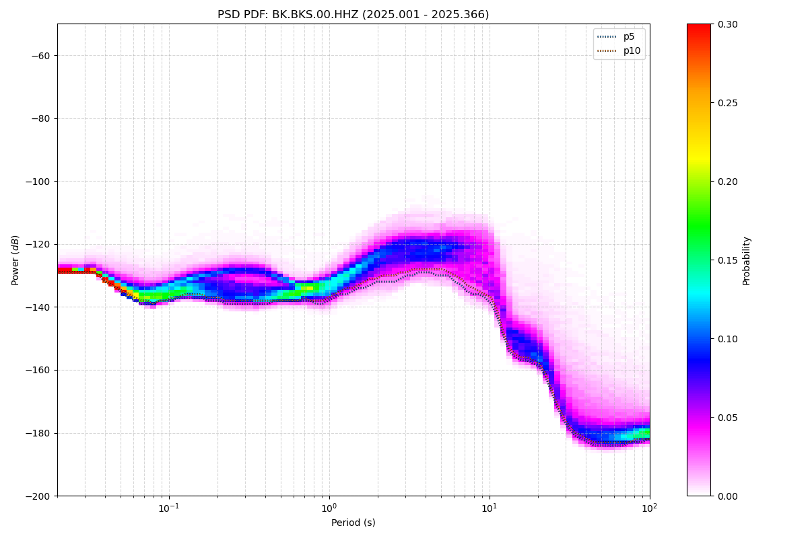
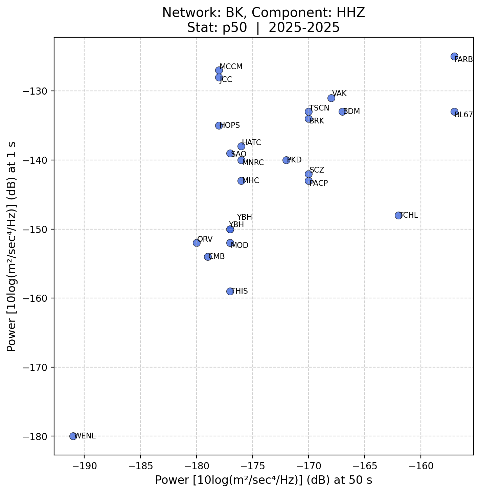

# Seismology Probability & PSD Analysis

A toolset for analyzing seismic noise by computing **probability density function (PDF) percentiles** from raw seismological data and generating **Power Spectral Density (PSD) scatter plots** that compare station noise levels across multiple seismic periods.

Built for the [Berkeley Seismology Lab](https://seismo.berkeley.edu/) (BSL) **BK network**, but adaptable to any network that produces `PDFanalysis.*.pdf` files.

---

## Table of Contents

- [Overview](#overview)
- [Project Structure](#project-structure)
- [Prerequisites](#prerequisites)
- [Installation](#installation)
- [Component 1: Probability Engine](#component-1-probability-engine)
- [Component 2: PSD Scatter Plotter](#component-2-psd-scatter-plotter)
- [Configuration Reference](#configuration-reference)
- [Output Formats](#output-formats)
- [Data Pipeline](#data-pipeline)
- [Legacy Scripts](#legacy-scripts)

---

## Overview

This project has two integrated components that work together:

1. **Probability Engine** (`probability/`) — Reads raw `PDFanalysis.*.pdf` files for a given station, component, and time range. Aggregates the probability distributions across all days, then computes percentile curves (e.g., p5, p50, p95). Outputs **CSV files** with percentile-power values for each period and **PNG heatmap plots** showing the full PDF with percentile overlays.

2. **PSD Scatter Plotter** (root-level modules) — Uses the probability engine's CSV output to extract PSD values at two specific periods (e.g., 50s and 1s) for each station. Plots all stations as a scatter plot so you can visually compare noise levels across the network and quickly identify outliers.

### What Problem Does This Solve?

Seismic stations have varying noise levels depending on their location, site conditions, and instrumentation. This toolset lets you:

- **Quantify noise** at any station as percentile curves across all periods
- **Compare stations** side-by-side on a scatter plot to find outliers
- **Track noise over time** by running the analysis on different time windows

---

## Project Structure

```
psd/
├── main.py                  # PSD plotter entry point
├── config.yml               # Configuration for the PSD plotter
├── config_loader.py         # Parses config.yml into PlotConfig
├── channel_builder.py       # Discovers active stations from BK channel summary
├── data_integration.py      # Runs probability engine + reads its CSV output
├── core_models.py           # Shared data classes (StationChannel, PSDPoint)
├── plotter.py               # Scatter plot + Excel generation
├── psd.py                   # Legacy: original monolithic PSD script
├── requirements.txt         # Python dependencies (all components)
├── .gitignore
│
├── probability/             # Probability engine (standalone)
│   ├── main.py              # Engine entry point (CLI)
│   ├── config.py            # Default constants (network, station list, etc.)
│   ├── core.py              # PdfRecord dataclass + line parser
│   ├── data_io.py           # File/directory reader + CSV writer
│   ├── processing.py        # PeriodPowerAggregator (percentile computation)
│   ├── visualization.py     # PDF heatmap plotter with percentile overlays
│   ├── probability.py       # Legacy: original monolithic probability script
│   ├── requirements.txt     # Engine-only dependencies
│   └── example_output/      # Pre-generated example results
│       ├── BKS/
│       │   ├── percentiles.BKS.HHZ.2025.1-2025.366.csv
│       │   └── percentiles.BKS.HHZ.2025.1-2025.366.png
│       ├── SAO/
│       └── ...              # (28 stations total)
│
└── psd_results/             # Pre-generated example PSD scatter plots
    ├── BK_HHZ_50vs1_p50.png
    ├── BK_HHN_50vs1_p50.png
    ├── BK_HHE_50vs1_p50.png
    └── BK_PSD_50vs1_p50.xlsx
```

---

## Prerequisites

- **Python 3.10+**
- Access to the BSL data directory structure (e.g., `/ref/dc14/PDF/STATS/`)
- The data directory must contain `PDFanalysis.*.pdf` files organized as:
  ```
  {root}/{network}.{station}.{location}/{component}/wrk{year}/PDFanalysis.{year}.{julday}.pdf
  ```
  Example:
  ```
  /ref/dc14/PDF/STATS/BK.BKS.00/HHZ/wrk2025/PDFanalysis.2025.005.pdf
  ```

---

## Installation

```bash
git clone https://github.com/matthew-ju/seismology-probability-analysis.git
cd seismology-probability-analysis
pip install -r requirements.txt
```

---

## Component 1: Probability Engine

The probability engine aggregates daily PDF data and computes noise percentiles.

### Usage

```bash
cd probability/
python3 main.py [OPTIONS]
```

### Examples

**Process a single station (BKS), all default components, for the year 2025:**
```bash
python3 main.py --stations BKS --start-year 2025 --end-year 2025
```

**Process multiple stations with specific components and custom percentiles:**
```bash
python3 main.py \
  --stations BKS SAO FARB \
  --components HHZ HHN HHE \
  --start-year 2025 --start-day 1 \
  --end-year 2025 --end-day 366 \
  --percentiles 0.05 0.10 0.25 0.50 0.75 0.90 0.95
```

**Use a different data root and network:**
```bash
python3 main.py \
  --root /path/to/your/PDF/STATS \
  --network CI \
  --location 00 \
  --stations PAS \
  --components HHZ
```

### CLI Arguments

| Argument | Default | Description |
|---|---|---|
| `--root` | `/ref/dc14/PDF/STATS` | Root path to the PDF/STATS directory |
| `--network` | `BK` | Seismic network code |
| `--location` | `00` | Location code |
| `--stations` | `BKS THOM` | Space-separated list of stations |
| `--components` | `HHE HHN HHZ HNE HNN HNZ` | Space-separated list of components |
| `--start-year` | `2025` | Start year (inclusive) |
| `--start-day` | `1` | Start Julian day |
| `--end-year` | `2025` | End year (inclusive) |
| `--end-day` | `366` | End Julian day |
| `--percentiles` | `0.01 0.05 ... 0.99 1.0` | Percentiles as fractions in [0, 1] |
| `--output-prefix` | `percentiles` | Prefix for output filenames |

### What It Does

1. For each station + component combination, iterates over all years in the requested range
2. Within each year, reads all `PDFanalysis.{year}.{julday}.pdf` files from the corresponding `wrk{year}/` directory
3. Each PDF file contains lines of `period_log10  power_dB  probability` — the engine sums probabilities across all files
4. After all files are processed, averages by file count and renormalizes to build a clean probability distribution per period
5. Walks the CDF at each period to find the power level at each requested percentile
6. Writes results to CSV and generates a heatmap PNG with percentile overlays

### Output

For each station + component, two files are created in a station subdirectory:

```
{station}/percentiles.{station}.{component}.{start_year}.{start_day}-{end_year}.{end_day}.csv
{station}/percentiles.{station}.{component}.{start_year}.{start_day}-{end_year}.{end_day}.png
```

**Example CSV** (`BKS/percentiles.BKS.HHZ.2025.1-2025.366.csv`):
```csv
period_log10,p1,p5,p10,p15,p25,p50,p75,p90,p95,p99,p100
-1.698970,-129.000,-129.000,-129.000,-129.000,-129.000,-129.000,-128.000,-128.000,-127.000,-125.000,-80.000
-1.661344,-129.000,-129.000,-129.000,-129.000,-129.000,-128.000,-128.000,-128.000,-127.000,-124.000,-80.000
...
```

- `period_log10`: log₁₀ of the period in seconds (e.g., `1.698970` = 50s, `0.0` = 1s)
- `p1` through `p100`: power in dB at each percentile

**Example PNG** — a heatmap of the full probability distribution with percentile curves overlaid (BKS HHZ, 2025):



The plot shows period (log₁₀ s) on the x-axis, power (dB) on the y-axis, and probability as a color mesh. Percentile lines (p5, p50, p95, etc.) are drawn on top so you can see the distribution shape at every period.

---

## Component 2: PSD Scatter Plotter

The scatter plotter compares all stations in the network by plotting each station's PSD value at two periods (one on each axis).

### Usage

```bash
# From the project root directory (not probability/)
python3 main.py [config.yml]
```

If no config file argument is given, it defaults to `config.yml` in the current directory.

### How It Works

1. **Reads `config.yml`** — gets the station list, time range, periods to compare, and which statistic to use
2. **Discovers active channels** — optionally cross-references with `BK.channel.summary.day` to ensure stations are currently active
3. **Runs the probability engine** — calls `probability/main.py` as a subprocess for all configured stations
4. **Reads the CSV output** — extracts the PSD value at period_x and period_y for each station/component
5. **Generates scatter plots** — one plot per component (HHZ, HHN, HHE), plus an Excel summary

### Example

Given this `config.yml`:

```yaml
base_dir: "/ref/dc14/PDF/STATS"
network: "BK"
stations: ["JCC", "MCCM", "FARB", "BDM", "SAO", "CMB", "BRK", "YBH"]
location: "00"
components: ["HHZ", "HHN", "HHE"]

period_x: 50       # x-axis: PSD at 50s period
period_y: 1        # y-axis: PSD at 1s period
stat: "p50"        # use the 50th percentile (median)

start_year: 2025
end_year: 2025
start_day: 1
end_day: 366

percentiles: [0.01, 0.05, 0.10, 0.15, 0.25, 0.50, 0.75, 0.90, 0.95, 0.99, 1.0]
```

Running:
```bash
python3 main.py config.yml
```

Produces:
```
Config loaded: 8 stations, stat=p50
Time range: 2025.1 – 2025.366
Periods: 50.0s vs 1.0s
Active stations: 8
Running probability engine for 8 stations...
Generated 24 PSD points
Saved plot: psd_results/BK_HHZ_50vs1_p50.png
Saved plot: psd_results/BK_HHN_50vs1_p50.png
Saved plot: psd_results/BK_HHE_50vs1_p50.png
Saved Excel: psd_results/BK_PSD_50vs1_p50.xlsx
Done. Results saved to psd_results/
```

### Output

Scatter plots saved to `psd_results/`:

- **PNG files**: One per component. Each station appears as a labeled dot. The x-axis is PSD at period_x, y-axis is PSD at period_y. Outlier stations are immediately visible.
- **Excel file**: One sheet per component, listing each station's PSD values at both periods.

**Example PSD scatter plot** — BK network HHZ, 50s vs 1s, p50 (2025):



Stations that cluster together have similar noise characteristics. Outliers far from the cluster may indicate site issues, instrumentation problems, or unusual local noise sources.

---

## Configuration Reference

### `config.yml` — PSD Plotter

| Field | Type | Required | Description |
|---|---|---|---|
| `base_dir` | string | ✅ | Root path to PDF/STATS data |
| `network` | string | ✅ | Network code (e.g., `"BK"`) |
| `stations` | list | ✅ | Station codes; use `[]` for all active stations |
| `location` | string | ✅ | Location code (e.g., `"00"`) |
| `components` | list | | Components to process (default: `["HHZ", "HHN", "HHE"]`) |
| `period_x` | number | ✅ | Period in seconds for x-axis |
| `period_y` | number | ✅ | Period in seconds for y-axis |
| `stat` | string | ✅ | Statistic to plot — see [Stat Options](#stat-options) |
| `out_dir` | string | ✅ | (Used for legacy compatibility) |
| `start_year` | int | | Start year (default: `2025`) |
| `end_year` | int | | End year (default: `2025`) |
| `start_day` | int | | Start Julian day (default: `1`) |
| `end_day` | int | | End Julian day (default: `366`) |
| `percentiles` | list | | Percentile fractions for the probability engine |

### Stat Options

Direct percentile names:
- `p1`, `p5`, `p10`, `p15`, `p25`, `p50`, `p75`, `p90`, `p95`, `p99`, `p100`

Legacy stat names (mapped to nearest percentile):

| Legacy Name | Maps To |
|---|---|
| `mode` | `p50` |
| `mean` | `p50` |
| `min` | `p1` |
| `max` | `p100` |
| `q_low` | `p25` |
| `q_high` | `p75` |

### `probability/config.py` — Engine Defaults

These defaults are used when the probability engine is run standalone (i.e., without being called by the PSD plotter):

```python
DEFAULT_ROOT       = "/ref/dc14/PDF/STATS"
DEFAULT_NETWORK    = "BK"
DEFAULT_LOCATION   = "00"
DEFAULT_STATIONS   = ("BKS", "THOM")
DEFAULT_COMPONENTS = ("HHE", "HHN", "HHZ", "HNE", "HNN", "HNZ")
DEFAULT_START_YEAR = 2025
DEFAULT_END_YEAR   = 2025
DEFAULT_START_DAY  = 1
DEFAULT_END_DAY    = 366
DEFAULT_PERCENTILES = [0.01, 0.05, 0.1, 0.15, 0.25, 0.50, 0.75, 0.9, 0.95, 0.99, 1.0]
```

All of these can be overridden via command-line arguments.

---

## Output Formats

### Percentile CSV

| Column | Description |
|---|---|
| `period_log10` | log₁₀ of the period in seconds |
| `p1` ... `p100` | Power level (dB) at each percentile |

Periods are spaced logarithmically from ~0.02s to ~202s. Power values are in units of 10·log₁₀(m²/s⁴/Hz) (dB relative to acceleration PSD).

### PSD Scatter Plot (PNG)

- Each dot = one station
- x-axis = PSD at `period_x` seconds
- y-axis = PSD at `period_y` seconds
- Labels are auto-adjusted to avoid overlap
- Title includes network, component, stat, and time range

### PSD Excel (XLSX)

One sheet per component. Columns:
- `Station` — station code
- `Power_{period_x}s` — PSD value at the x-axis period
- `Power_{period_y}s` — PSD value at the y-axis period

---

## Data Pipeline

```
┌─────────────────────────────────────────────────────────────┐
│  Raw Data: PDFanalysis.{year}.{julday}.pdf                  │
│  (one file per week, per station/component/year)            │
│  Format: period_log10  power_dB  probability                │
└──────────────────────────┬──────────────────────────────────┘
                           │
                           ▼
┌──────────────────────────────────────────────────────────────┐
│  Probability Engine (probability/main.py)                    │
│  1. Sum probabilities across all PDF files                   │
│  2. Average by file count, renormalize per period            │
│  3. Walk CDF to find power at each percentile                │
│  4. Write CSV + heatmap PNG                                  │
└──────────────────────────┬───────────────────────────────────┘
                           │
                           ▼
┌──────────────────────────────────────────────────────────────┐
│  Percentile CSVs                                             │
│  percentiles.{station}.{component}.{time_range}.csv          │
│  Columns: period_log10, p1, p5, p10, ..., p99, p100         │
└──────────────────────────┬───────────────────────────────────┘
                           │
                           ▼
┌──────────────────────────────────────────────────────────────┐
│  PSD Scatter Plotter (main.py)                               │
│  1. Read CSV value at target period_x and period_y           │
│  2. Plot all stations as (PSD_x, PSD_y) scatter              │
│  3. Save PNG per component + Excel summary                   │
└──────────────────────────────────────────────────────────────┘
```

---

## Legacy Scripts

Two original monolithic scripts are preserved for reference:

- **`psd.py`** — The original all-in-one PSD scatter plotter. Reads pre-computed `PDFanalysis.sts` summary files directly (from the `wrk/` directory) instead of computing percentiles from raw PDF files. Uses stat names `min`, `mean`, `q_low`, `q_high`, `max`, `mode`.

- **`probability/probability.py`** — The original all-in-one probability analysis script before it was modularized into `core.py`, `data_io.py`, `processing.py`, and `visualization.py`.

These are not used by the current pipeline but are kept as historical references.
